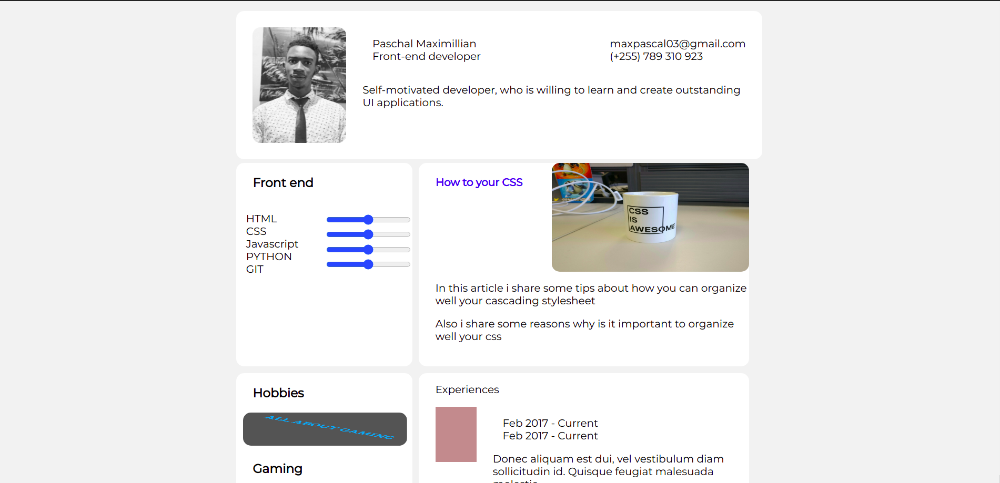

<!-- Please update value in the {}  -->

<h1 align="center">Portifolio|Master</h1>

   Solution for a challenge from  <a href="http://devchallenges.io" target="_blank">Devchallenges.io</a>.

<!-- TABLE OF CONTENTS -->

## Table of Contents

- [Overview](#overview)
  - [Built With](#built-with)
- [Features](#features)
- [Contact](#contact)
- [Acknowledgements](#acknowledgements)

<!-- OVERVIEW -->

## Overview

- You can see a demo [here](https://happy-hermann-c829e3.netlify.app/)
- A grid layout and a flex display simplfy works
- Imagine i built this within one hour easy innit?
- Put on a smile when you are coding:)

### Built With

<!-- This section should list any major frameworks that you built your project using. Here are a few examples.-->

- Html
- Css

## Features
- [x] User story:You  can see a page following the given design.
- [x] User story:You  can see personal details.
- [x] User story:You   can see projects
- [x] User story:You    can see hobbies 
<!-- List the features of your application or follow the template. Don't share the figma file here :) -->

This application/site was created as a submission to a [DevChallenges](https://devchallenges.io/challenges) challenge. The [challenge](https://devchallenges.io/challenges/5ZnOYsSXM24JWnCsNFlt) was to build an application to complete the given user stories.

## Acknowledgements

<!-- This section should list any articles or add-ons/plugins that helps you to complete the project. This is optional but it will help you in the future. For example: -->

- [Steps to replicate a design with only HTML and CSS](https://devchallenges-blogs.web.app/how-to-replicate-design/)
- [Node.js](https://nodejs.org/)
- [Marked - a markdown parser](https://github.com/chjj/marked)

## Contact

- Website [pascalmax.com](https://pascalmax.netlify.app/)
- GitHub [Pascal488](https://github.com/Pascal488)
- Instagram [Paschal_maximillian](https://www.instagram.com/paschal_maximillian/)
